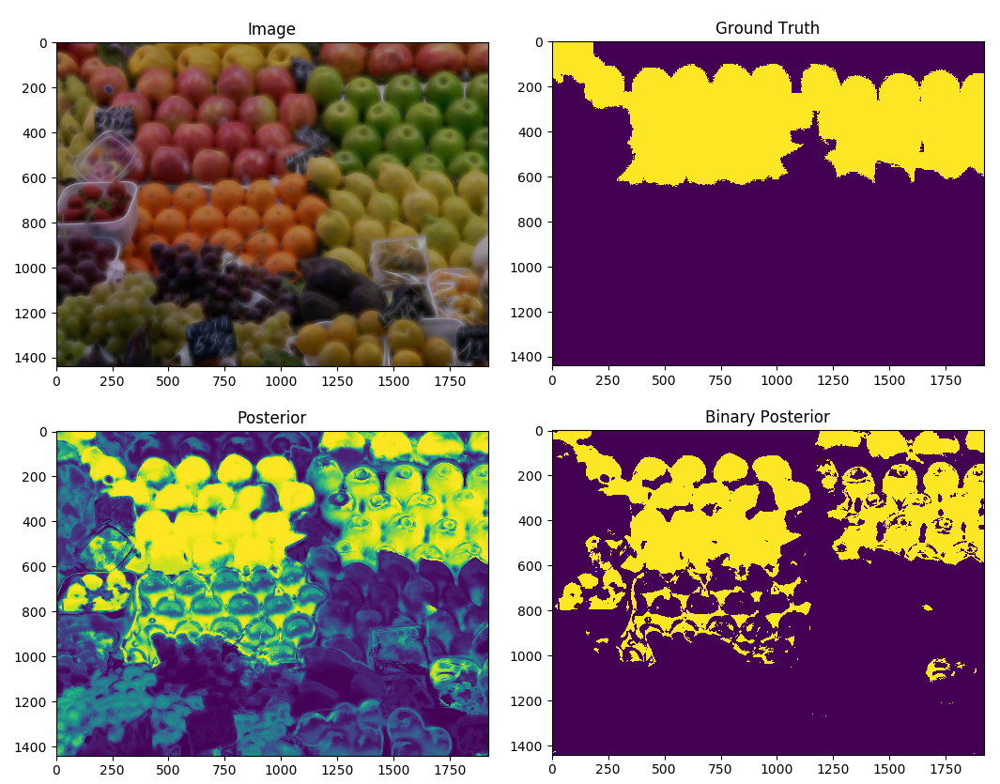

# computer_vision
Various mini-projects in the computer vision field, with inspiration from the Machine Vision course I took at UCL (MSc in Computational Statistics and Machine Learning)

## Project 1: Mixture of Gaussians - Pixel-by-Pixel Classification

The `gaussians` directory includes an implementation of a pixel-by-pixel classifier using a mixture of gaussians model, including the full machine learning pipeline for training, validation and test with a full writeup on the results and implementation details (including working example code for reproducibility). 

The example code shows how to train a model to classify pixels as 'apples' or 'not apples' as below:

