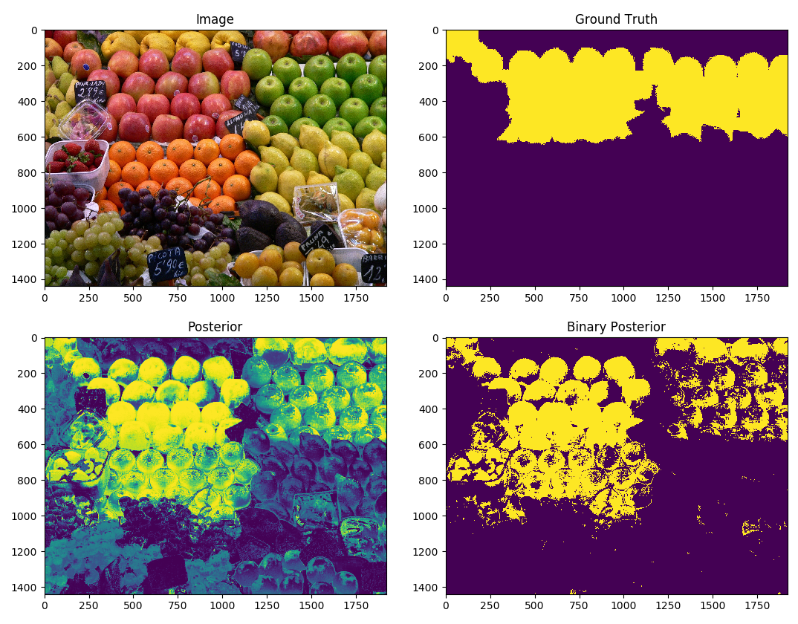

# Introduction

Performs pixel-by-pixel binary classification of images using a mixture of gaussians model over the pixel data. Although not a state-of-the-art algorithm by any means, it could be used in the pipeline of a rudimentary classification or image segmentation program.

The code is a complete implementation of an end-to-end machine learning system, allowing for training, tuning and testing of image data. There are methods provided for automatic hyperparameter tuning and evaluation metrics (scores and graphs) to understand the model better.

Usage example: Classify pixels in an image corresponding to skin, and not skin (hence binary). To do this, you would need a train set consisting of images and ground truth labels (corresponding image with all skin pixels painted white, and non-skin pixels painted black). Similarly, to classify apples against non-apples, you would do the same, but with white pixels corresponding to apples, and black pixels corresponding to anything else.

# Model Deficiencies

During the classification phase each pixel is treated individually from one another - one pixel being classified as a 'skin' pixel plays no role in the classification of its neighbours. Of course, this shows there is room for improvement (a different model altogether, such as a probabilistic graphical model, Ising representation, etc). A quirky consequence of this is that you could have alternating classes for neighbouring pixels - skin, not skin, skin, not skin, etc (obviously not the case observed 'in the wild')!

Note also that this model is heavily reliant on the colours in each pixel (this is what the gaussians are fitting), and hence pixels of similar colour (for example a red apple and strawberries) will be modelled similarly, which is what owes to the majority of classification errors in this kind of model. For this reason a gabor filter class is also added to help model texture, although this is not used extensively and is just for implementation purposes (i.e. it works, but its parameters are not included in the automatic hyperparameter tuning stage currently). Feel free to modify this and submit a pull request.

Finally, I have not added in a method for cross-validation, which would definitely help with preventing over-fitting during the `tune` method. This could easily be added (for example a k-fold or monte-carlo cross validation method) but I left it out as the purpose of this was to simply provide an implementation of the mixture of gaussians model. Feel free to add it and submit a pull request, however.

# Usage

There are effectively two pipelines which can be used:

1.  Train >> Test
2.  Tune >> Test

The tuning stage finds the optimum hyperparameters to increase the model accuracy on unseen data (test set), and subequently trains the model using these hyperparameters (hence the omission of an explicit `Train` step in pipeline 2.)

How to create the classifier and load in training data:

~~~~
# Create the classifier
# Set gabor to True to run a gabor filter over all data when it is passed through
classifier = BinaryClassifier(gabor=False, log=True)

# Load in the training images (train_images and train_truths are lists of file paths)
classifier.load_train_images(train_images, train_truths, display=False)
~~~~

The next step is to choose whether or not you want to explicitly set the model parameters (pipeline 1):

~~~~
# Train with k=3 gaussians
classifier.train(k=3)

# Set the discrimination threshold to 0.5
classifier.set_threshold(0.5)
~~~~

Or rather pass in a labeled validation set to find the optimum parameters and then train on it (pipeline 2):

~~~~
# Tune over k=1 to k=5 gaussians
classifier.tune(tune_images, tune_truths, max_k=5, display=False)
~~~~

And finally, let's see how it works on unseen images!

~~~~
classifier.test(test_images, truths=test_truths, display=True)
~~~~

The full implementation with example images can be seen in `implementation.py`.

# Implementation Details & Results

Below are the results of running the model (pipeline 2 with hyperparameter optimisation) as provided in `implementation.py` with and without the gabor filter (for comparison). Note that I have set `results=True` in the tune step to yield the ROC curves. `./images/6.jpg` is used to show the power of the model, and `./images/5.jpg` to show its weaknesses. As discussed earlier, similar colours can lead to bad classification, (in the case of `./images/5.jpg`) and hence the low F1 score. This is where the gabor filter can help, by discriminating by textures as well as colours.

## Test Images

Below are the images which we want to see how well the learned model works on (which we can do as we have labeled ground truth masks)!

### Image A (`./images/5.jpg`)

### Image B (`./images/6.jpg`)

## Without Gabor Filter

Best F1 score: 0.467 for threshold of 0.74 and k = 4

Best ROC score: 0.698 for threshold of 0.58 and k = 4

### ROC Curve

### Image A Results

Image [./images/5.jpg]: F1 = 0.2587, ROC = 0.4339

### Image B Results

Image [./images/6.jpg]: F1 = 0.5991, ROC = 0.5129

## With Gabor Filter

This uses the default gabor filter parameters provided in `Gabor.py` with no optimisation.

Best F1 score: 0.504 for threshold of 0.76 and k = 5

Best ROC score: 0.703 for threshold of 0.55 and k = 3

### ROC curve:

### Image A Results

Image [./images/5.jpg]: F1 = 0.2617, ROC = 0.4312

### Image B results

Image [./images/6.jpg]: F1 = 0.7388, ROC = 0.6658

